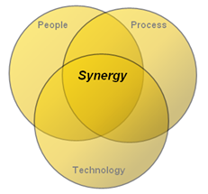

# iQ Gaming
## What is iQ Gaming?

**[What is iQ Gaming?](https://www.youtube.com/watch?v=SzL5gtDy30Q)**

## What is iQ Gaming?

iQ Gaming™ methodology consists of three integrated components:

1. Approach
2. Focus 
3. Process

#### Vendor Driven Projects

The implementation of many software systems in the casino gaming industry are driven primarily by a vendor installing their product. The overall vision of the implementation project is constrained by the vendors “micro-level” perspective of their individual product and not necessarily how that product must interact with other systems.

Because of the understandable focus of individual vendors exclusively to their own product, the result is an implementation model that resembles “functional silos” of systems (see Figure 1 below). While there may be some data exchanged between these systems via file transfers, the overall implementation methodology does not deliver an integrated solution.

### Functional System Silos

Another limitation of systems implementation projects driven exclusively by vendors is an observed focus primarily on their technology, with little consideration of how that technology must integrate with the customer’s employees (people) and business processes. The result is an implementation that provides for limited integration of people, process & technology (see Figure 2 below).

The implementation approach taken by many vendors with regards to people is limited to training only. Many times, this training stresses simply “how” their software operates (i.e.; “…press this button to do this…”) and not “why” the software is needed (i.e.; “…the reason you need to press this button is…”).

Additionally, the implementation approach taken by many vendors in the casino gaming industry regarding the integration of business processes with their products is limited to minimal internal controls (“MICS”) as defined by regulation.

### Limited Integration of People, Process & Technology

#### Qualex Driven Projects

An integral aspect of Qualex’s iQ-Gaming™ methodology is an approach that provides a “macro-level” perspective of the total project.

Instead of focusing on the integration of a single software solution, Qualex will focus on the integration of all systems with a goal of achieving full integration and interpretability across all systems.

Additionally, Qualex will pursue full integration of people, process & technology with goals of:

- Ensuring the technology is implemented & configured to achieve optimum performance
- Customer staff not only knows how to use the software, but also understand the result of their use of the software
- Customer business processes are mapped into the functionality provided by selected software solutions

The term “synergy” can be defined as “an environment where the whole is greater than the sum of its parts”. Qualex’s macro level approach to pursuing full integration and interpretability across all systems and the successful integration of people, process & technology will strive to create synergy for our customers (see Figures 3 and 4 below).

### Summary

A leader in the casino and hospitality management industry, Qualex Consulting Services, Inc., has implemented complex business solutions in multiple casino environments; including, large Las Vegas casinos, race-track casinos & Native American casinos.

Qualex can help casinos in the following ways:

- Accurately measure and predict patron P&L.
- Maximize patron profitability and overall revenue.
- Report and analyze key performance metrics in one place including slot utilization, total revenue per top patrons, trips, stays, comps, Theo and actual, or revenue for key geographies.
- Automate and track customer communications, e.g., marketing campaigns.
- Decrease employee turnover and predict staffing needs.
- Detect fraud and other suspicious gaming floor activities.

- - -

Copyright © 2020 Qualex Consulting Services Incorporated.